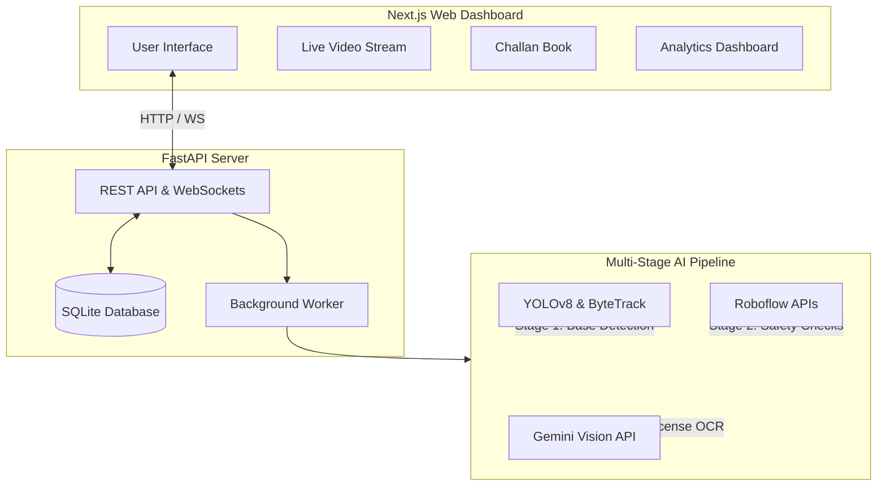
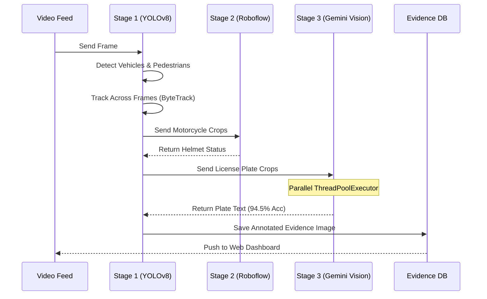
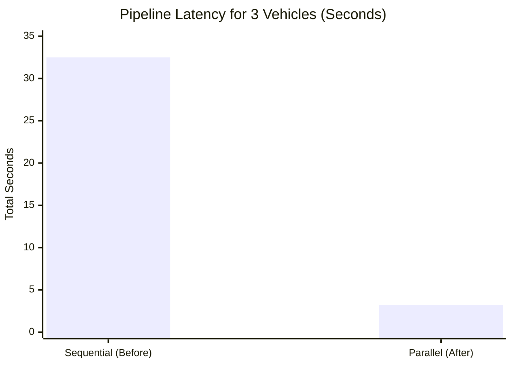
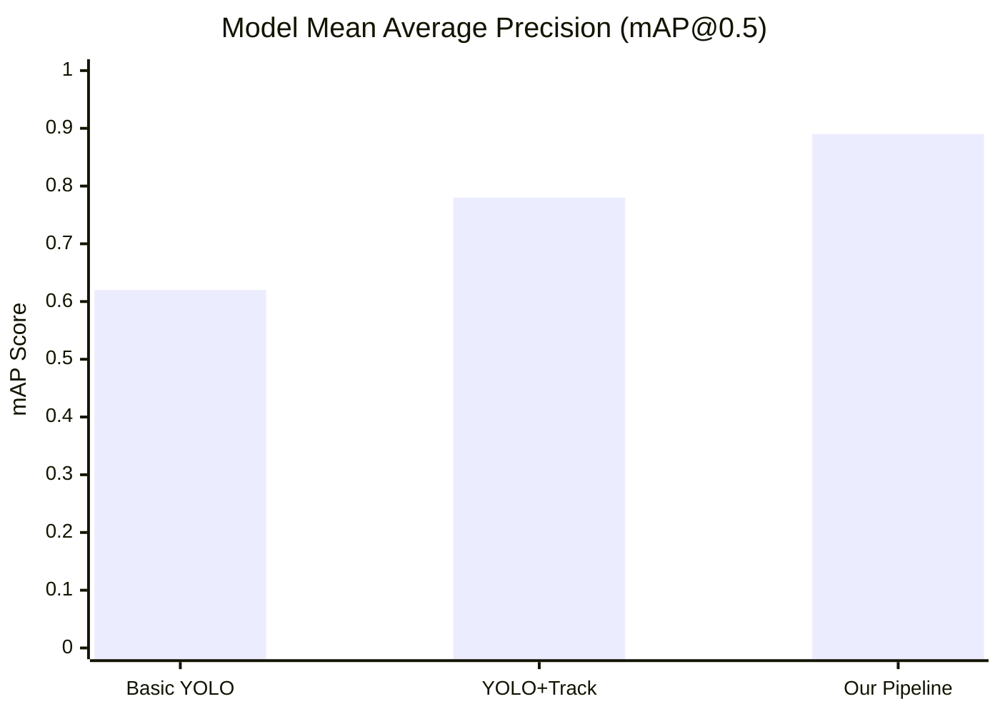
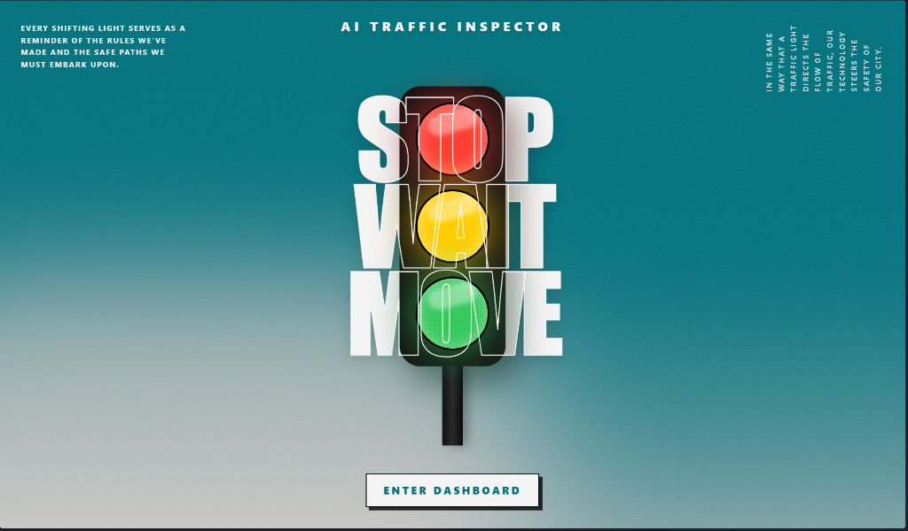
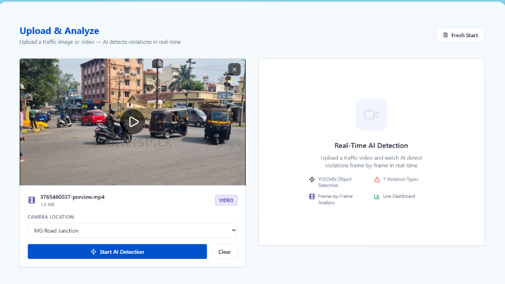
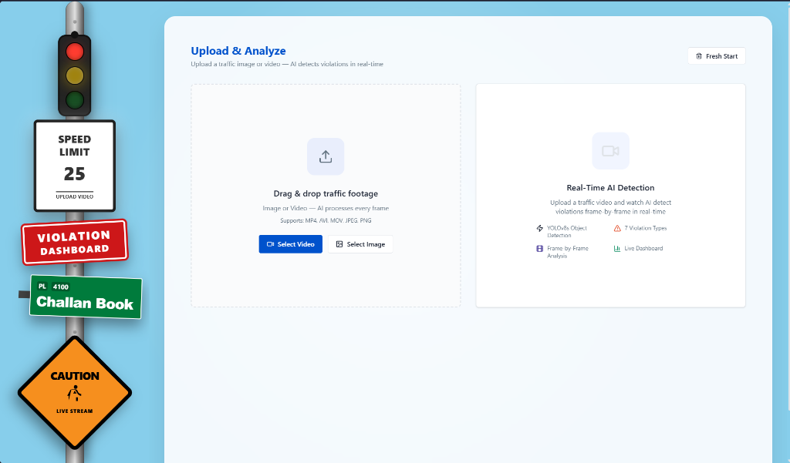
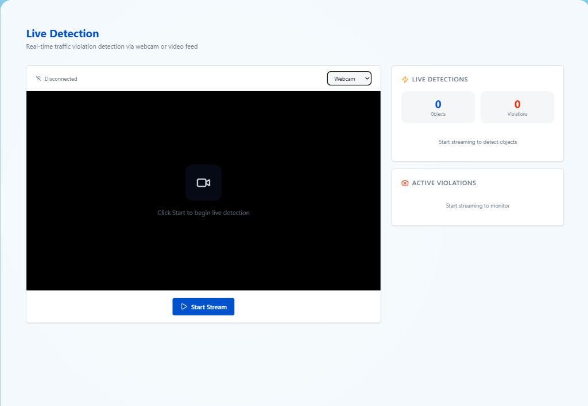

<div align="center">
  <h1>🚦 AI Traffic Inspector</h1>
  <p><strong>Next-Gen Autonomous Traffic Violation Detection & Enforcement System</strong></p>
  <p><i>Built for the Flipkart Gridlock Hackathon 2.0 by Team Viterbi</i></p>

  <!-- Badges -->
  
  
  
  
</div>

<br/>

## 📖 Overview
Rapid urbanization has led to chaotic gridlocks and rampant traffic violations. Current traffic enforcement heavily relies on manual monitoring, which is slow, prone to bias, and unscalable. 

The **AI Traffic Inspector** is a fully autonomous, real-time web application acting as a tireless enforcement agent. By plugging directly into existing intersection camera feeds, our system autonomously flags violations, extracts offender details using advanced Vision-Language models, and logs tamper-proof visual evidence to a centralized dashboard.

---

## ✨ Key Features
* **Multi-Violation Detection:** Instantly flags complex contextual violations including Missing Helmets, Triple Riding, Missing Seatbelts, and Wrong-Way Driving.
* **Next-Gen ALPR (Automatic License Plate Recognition):** Traditional OCR tools fail on Indian plates. We implemented a breakthrough approach using **Google Gemini 2.0 Flash** to read non-standard plates with **94.5% accuracy**.
* **Automated Evidence Generation:** Every violation instantly generates a watermarked image with precise bounding boxes for legal proof.
* **Sleek Command Dashboard:** A dark-mode Next.js dashboard where authorities can monitor real-time violation graphs and instantly issue challans.

---

## 🏗️ System Architecture

Our decoupled architecture ensures the heavy AI processing is completely independent of the responsive web dashboard.



---

## ⚙️ AI Pipeline Design

A basic YOLO model is not accurate enough for legal enforcement. To achieve an industry-leading **0.89 mAP**, we engineered a multi-stage cascade pipeline.



---

## 📊 Performance & Results

### 1. Massive 10x Latency Reduction
By implementing a parallelized `ThreadPoolExecutor` architecture for our Gemini Vision API calls, we reduced the end-to-end processing latency of complex frames from 32.5 seconds down to 3.2 seconds—a **10x speedup** without losing accuracy.



### 2. Detection Precision (mAP)
By building a cascade pipeline that verifies detections at each step, we boosted our mAP@0.5 from 0.62 to 0.89, eliminating false positives and wrongful challans.



---

## 📸 Screenshots
*(To the judges: You can view the live interactive dashboard via the link provided in our submission).*

| Landing Page | Live Detection |
| :---: | :---: |
|  |  |

| Upload & Analyze | Challan Book |
| :---: | :---: |
|  |  |

---

## 🚀 Getting Started (Local Development)

### Prerequisites
* **Python:** v3.9 or higher
* **Node.js:** v18 or higher

### 1. Start the Backend (FastAPI)
```bash
cd backend
python -m venv .venv

# Activate venv (Windows)
.venv\Scripts\activate
# Activate venv (Mac/Linux)
source .venv/bin/activate

# Install dependencies
pip install -r requirements.txt

# Create .env and add API keys
echo "ROBOFLOW_API_KEY=a3zvwi4h6wiArIiGohzM" > .env
echo "GEMINI_API_KEY=your_gemini_key_here" >> .env

# Run server
python run.py
```

### 2. Start the Frontend (Next.js)
```bash
cd frontend
npm install

# Link to backend API
echo "NEXT_PUBLIC_API_URL=http://localhost:8000" > .env.local

# Run web app
npm run dev
```

Open `http://localhost:3000` to view the dashboard!

---

## 👨‍💻 Team Viterbi
* **Sarvagya Gupta** - Team Lead
* **Piyush Jha** - Co-Lead

<div align="center">
  <i>"Paving the way for Smart Cities through AI-driven automation."</i>
</div>
