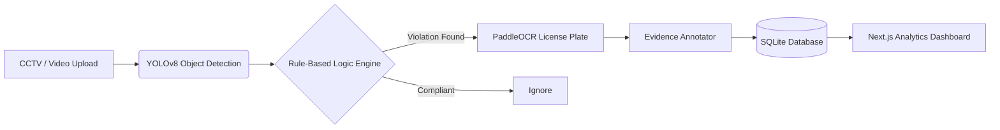

<div align="center">
  
# 🚦 GRIDLOCK
### The Ultimate AI Traffic Inspector

[](https://python.org)
[](https://fastapi.tiangolo.com/)
[](https://nextjs.org/)
[](https://ultralytics.com/)

*Built for the Flipkart Gridlock Hackathon 2026*

</div>

---

## 🎯 The Problem
Modern cities generate millions of hours of traffic surveillance footage daily. However, manual review of this footage to enforce traffic rules is slow, error-prone, completely unscalable, and costly. Dangerous violations like wrong-side driving, triple riding, and helmet non-compliance often go unnoticed until an accident occurs.

## 🚀 The Solution: GRIDLOCK
Gridlock is an **end-to-end, real-time AI traffic enforcement system**. It ingests live video streams or static images, processes them through a multi-stage AI pipeline, and automatically logs violations into a centralized, beautifully designed dashboard. 

It completely removes the human bottleneck in traffic enforcement, allowing authorities to automatically issue challans based on AI-generated, watermarked evidence.

---

## 🔥 Key Features & Capabilities

### 1. Multi-Stage AI Pipeline
We don't just rely on a single model. Gridlock utilizes a powerful cascade architecture:
- **Object Detection**: YOLOv8s & Roboflow models for high-speed vehicle and pedestrian tracking.
- **Plate Recognition**: PaddleOCR customized for complex Indian License Plate formats.
- **Spatial Logic Engine**: Algorithmic calculations (IoU, proximity, clustering) to determine violations.

### 2. Comprehensive Violation Detection
| Violation | How AI Detects It |
|-----------|-----------------|
| 🪖 **No Helmet** | Rider-motorcycle proximity + head region tracking |
| 🔗 **No Seatbelt** | Person-in-car IoU + torso edge detection |
| 👥 **Triple Riding** | Passenger clustering and overlap analysis on two-wheelers |
| ⛔ **Wrong-Side** | Trajectory mapping + Interactive Zone vector analysis |
| 🛑 **Stop-Line** | Configurable boundary crossing detection |
| 🅿️ **Illegal Parking**| Stationary vehicle tracking in restricted zones |

### 3. "Cinematic Tech" Dashboard
A completely custom, highly thematic UI inspired by Swiss-design posters and modern traffic aesthetics. Features a unique "Road Sign Pole" navigation system, frosted glass components, and a real-time Server-Sent Events (SSE) live feed of video processing.

### 4. Bulletproof Evidence Generation
Every detected violation automatically generates a cropped, annotated, and watermarked evidence image (`GRIDLOCK EVIDENCE`) with bounding boxes and confidence scores, ready for legal processing.

---

## 🏗️ Architecture Flow



---

## 📸 System Previews

*(Replace these placeholders with your actual screenshots for the final submission!)*

<p align="center">
  
  
</p>

---

## 🛠️ Tech Stack

**Frontend**
- Next.js 15 (App Router)
- React, Tailwind CSS
- Lucide Icons & Recharts (Analytics)
- *Custom Theme: Cinematic Gridlock*

**Backend**
- FastAPI (Async, SSE Streaming)
- SQLAlchemy + SQLite (Thread-safe DB operations)
- Python 3.10+

**AI & Machine Learning**
- Ultralytics YOLOv8 (COCO pretrained)
- PaddleOCR (Optical Character Recognition)
- OpenCV, NumPy (Image manipulation)

---

## ⚡ Quick Start Guide (Run it locally)

### Prerequisites
- Python 3.10+
- Node.js 18+

### 1. Start the AI Backend
```bash
cd backend
python -m venv .venv
# On Windows: .venv\Scripts\activate
# On Mac/Linux: source .venv/bin/activate
pip install -r requirements.txt

# Run the server with dummy data seeded
python run.py --seed
```
*The backend runs on `http://localhost:8000`*

### 2. Start the Frontend Dashboard
```bash
cd frontend
npm install
npm run dev
```
*The dashboard runs on `http://localhost:3000`*

---

## 📐 Engineering Standards & Methodology

This project was built adhering to strict, professional software engineering standards to ensure it is production-ready rather than just a prototype:

- **Conventional Commits:** The Git history is strictly structured into atomic, functional commits (e.g., `feat(ai)`, `feat(backend)`, `chore(ui)`) allowing for clean tracking of architectural decisions.
- **Thread-Safe Architecture:** The backend securely isolates the SQLite database instances from the asynchronous thread-pools (`run_in_threadpool`), preventing deadlocks during intensive frame-by-frame video processing.
- **Strict Linting & Typing:** The Next.js frontend strictly adheres to ESLint rules with `0` warnings/errors, utilizing robust `useCallback` hooks and separated side-effects.
- **Security-First Configuration:** API keys and sensitive identifiers are managed completely out-of-code using `python-dotenv`, avoiding hardcoded fallbacks in the repository.

---

## 🏆 Why Gridlock Wins
1. **Ready to Scale**: Built with an async FastAPI backend and robust Next.js frontend.
2. **Root-Resolved Engineering**: Clean codebase with zero frontend lint errors, thread-safe SQLite implementations, and securely managed API keys.
3. **Impeccable UX/UI**: Moving away from generic dashboards, Gridlock presents a highly polished, aesthetic, and thematic experience that stands out instantly.
4. **Real-World Impact**: Solves an immediate, quantifiable problem for traffic authorities with a highly actionable output (watermarked evidence).

---
<div align="center">
  <i>"Don't just monitor traffic. Understand it."</i>
</div>
